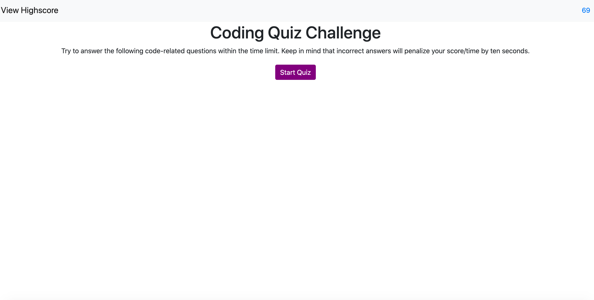
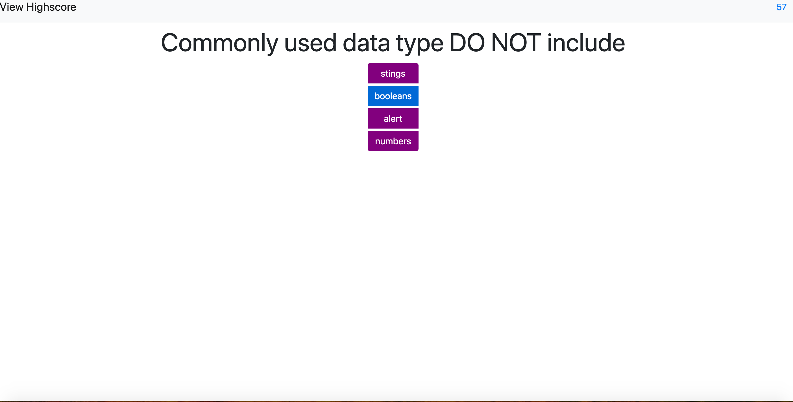
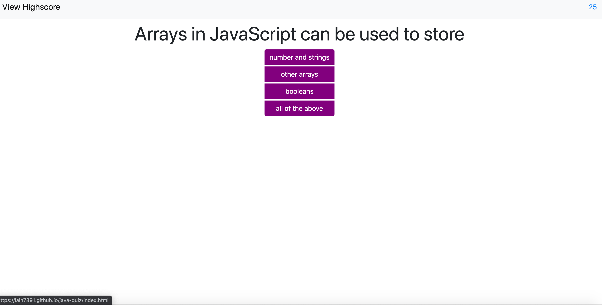

# java-quiz

For this assignment we needed to create a JavaScript quiz from scratch.  Once the HTML was created I pseudo code what I needed to do to make the JavaScript work and to dynamically do everything in the script.js. The page holds a start button which then takes you to all the questions and choices. For my code, depending what answer they choose then a alert would populate informing you if you were right or wrong. This assignment was a challenge and perhaps with more understand of JS and more time I would have been able to put this together properly. 

#Installation

*	Created a git repository
*	Created two files (HTML, JS) were all created but it was the JS file that was mostly used and updated.
*	What I used to create the quiz from JavaScript:
*	Document Object Model (DOM)
*	Functions
*	Conditionals (If/Else statements)
*	Console logging
*	Strings and alerts
*	Event listeners
*	For Loops
*	Set Intervals
*	Set Attributes

https://lain7891.github.io/java-quiz/

This assignment was incredibly difficult for me to complete in the time frame we were given. While I have an idea of what concepts are needed to make certain things run in the quiz, it is putting them together that confuse me. My tutor was able to help me with some issues, but not enough to help me understand how to piece everything together.

#License

Used MIT License for this assignment. 
